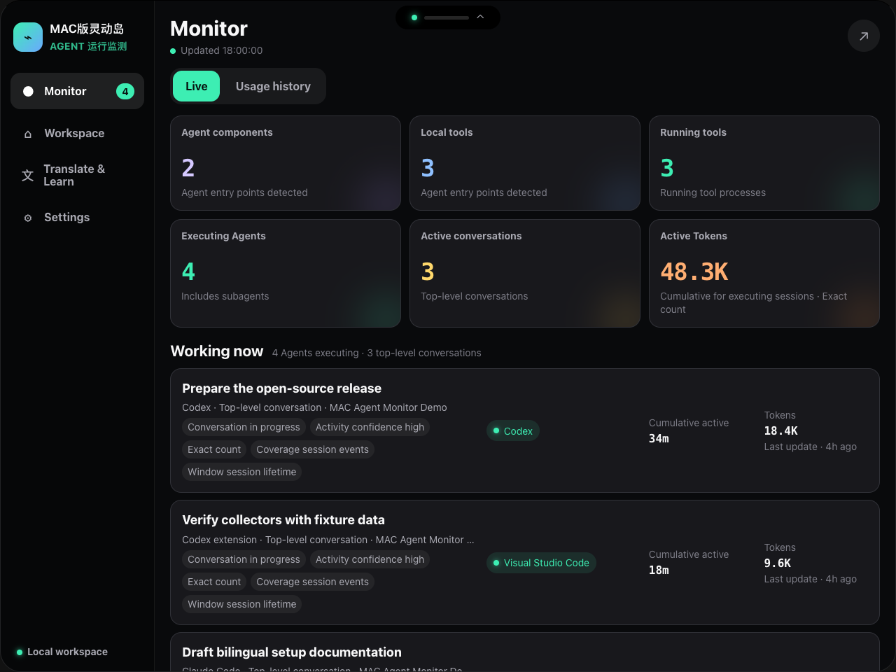
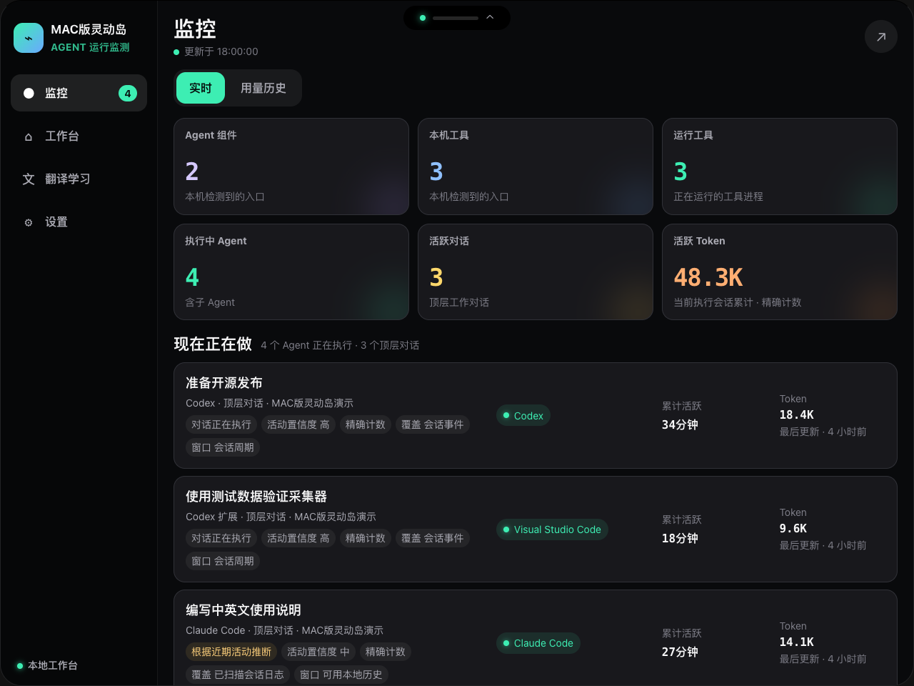
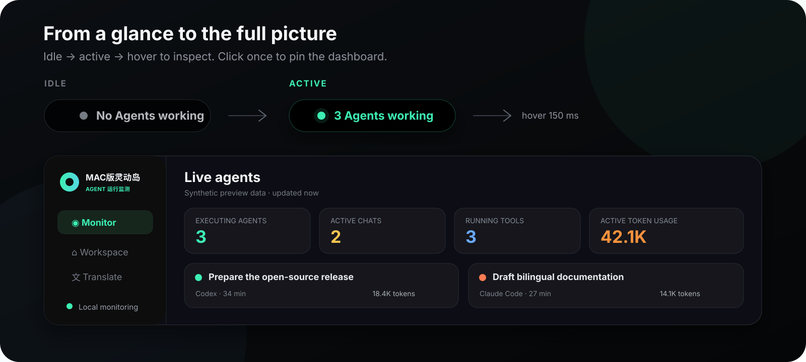
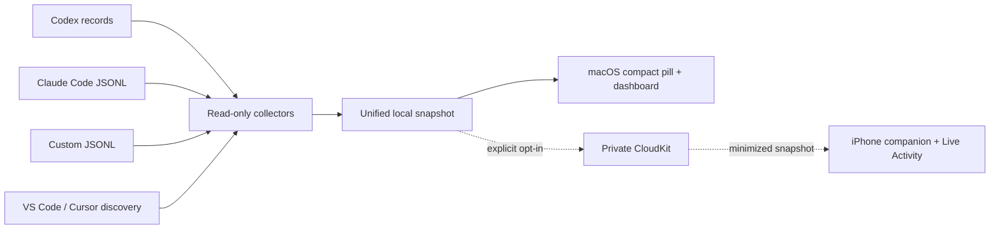

# MAC版灵动岛--Agent运行监测

### Local AI Agent Observatory for macOS

[简体中文](README.zh-CN.md) · [Product site](https://kiki-lgtm-dot.github.io/mac-agent-monitor-app/) · [Privacy](https://kiki-lgtm-dot.github.io/mac-agent-monitor-app/privacy/) · [Support](https://kiki-lgtm-dot.github.io/mac-agent-monitor-app/support/) · [License](LICENSE)

Know which agents are working—without leaving your flow.

**MAC版灵动岛--Agent运行监测** is a local-first macOS panel that lives around the camera/notch area. Its compact view shows only whether agents are active; hover to reveal live sessions, active time, tool state, and token usage. It also includes quick links, notes, and an optional translation-and-learning workspace.

### English interface



### 中文界面



> **Project status:** source preview. The macOS app is usable for local development. The iPhone companion, private CloudKit sync, signing, notarization, and App Store configuration still require your own Apple Developer identifiers and real-device validation.

## What it does

- **A quiet one-line status:** `3 Agents working` or `No Agents working` in a 220 × 34 pt compact pill.
- **Hover-to-expand dashboard:** see relevant tools, active agents, conversations, elapsed time, and reported token usage without switching apps.
- **Honest usage history:** separates input, cached input, output, reasoning, and total-only records while preserving the source's quality and coverage semantics.
- **Multiple local sources:** reads supported Codex and Claude Code structured records and can connect to custom JSONL telemetry.
- **Tool discovery without guesswork:** detects supported hosts such as VS Code and Cursor, while keeping “installed/running” separate from “an agent is working” and “tokens are measurable.”
- **Useful workspace:** quick websites, notes, bilingual UI, translation, one-sentence definitions, breakdowns, examples, and a searchable study book.
- **Review without local logs:** an explicitly entered, purple-labelled offline example shows fictional Agent, conversation, duration, and token data without reading Agent sources or accessing the network/iCloud.
- **Optional companion:** an experimental SwiftUI iPhone dashboard and Live Activity target are included under `ApplePlatforms/iOS`.



## Privacy boundary

The app starts local monitoring only after the user accepts a native disclosure.

- Agent discovery and usage scans are read-only.
- Prompt and response bodies are not extracted, displayed, or stored.
- Camera, microphone, screen-recording, and Accessibility permissions are not requested.
- Notes, links, study items, and monitoring data stay on the Mac by default.
- Translation sends only the text the user explicitly submits to the configured OpenAI-compatible endpoint. Its API key is stored in macOS Keychain, not the web view or workspace file.
- Private iCloud sync is off by default and exports a minimized allow-listed snapshot. Conversation titles require a separate opt-in.
- The offline example rebuilds fictional monitoring data in memory, hides prior source authorization, and leaves real monitoring off after exit; existing Workspace content remains ordinary local user content.

Review the implementation-specific details in [Data handling and privacy labels](docs/release/DATA_HANDLING_AND_PRIVACY_LABELS.md). The bundled policies are release drafts and must be completed for the shipping build.

The bilingual public [Privacy Policy](https://kiki-lgtm-dot.github.io/mac-agent-monitor-app/privacy/) and [Support page](https://kiki-lgtm-dot.github.io/mac-agent-monitor-app/support/) are published from `docs/site`; the release scripts use those stable HTTPS URLs.

## How it works



The macOS shell is AppKit plus `WKWebView`; it does not use Electron or third-party runtime dependencies. The collectors normalize source-specific evidence into one session model before the UI aggregates it.

## Supported evidence

| Source | Discovery | Active state | Duration | Token history |
| --- | --- | --- | --- | --- |
| Codex local SQLite / JSONL | Yes | Turn/session evidence | When reported | Input, cached input, output, reasoning, or total-only fallback |
| Claude Code JSONL | Yes | Recent structured activity | When reported | Input, cached input, output |
| VS Code / Cursor hosts and extensions | Yes | Host/process state only unless a session can be attributed | Host runtime | `—` unless a supported source reports usage |
| Custom JSONL | User-connected | Source-reported or heartbeat evidence | When reported | Source-reported fields |

Installed software is never treated as proof that an agent is currently working. Missing token telemetry is displayed as unavailable rather than estimated from runtime.

## Build and run

Requirements: macOS 13 or newer, Apple Command Line Tools, and the system `jq` used by the test suite.

```bash
git clone https://github.com/kiki-lgtm-dot/mac-agent-monitor-app.git
cd mac-agent-monitor-app
./scripts/build-app.sh
open 'dist/MAC版灵动岛--Agent运行监测.app'
```

The build is ad-hoc signed for local development. It is not a notarized public binary.

Run all static and fixture tests:

```bash
./scripts/test.sh
./ApplePlatforms/iOS/scripts/validate-project.sh
```

The optional `--build` iOS validation requires a full Xcode installation with the matching iOS SDK.

## Custom JSONL

Connect a `.jsonl` file or directory from **Settings → Advanced · Custom sources**. A minimal event looks like this:

```json
{
  "agent_id": "worker-01",
  "agent_name": "Docs reviewer",
  "status": "working",
  "timestamp": "2026-09-02T10:00:00Z",
  "duration_ms": 42000,
  "usage": {
    "input_tokens": 8200,
    "cached_input_tokens": 6100,
    "output_tokens": 940
  }
}
```

Connection codes register a local path and display metadata only; they do not execute commands or fetch remote content.

## Measurement semantics

- Token values are source-observed usage, not provider billing totals.
- Cache input is a subset of input and is not added to totals twice.
- Session-lifetime totals are not presented as a fabricated daily trend.
- Records preserve quality labels such as `exact`, `currentCounter`, `totalOnly`, `reported`, and `estimated`.
- Local schemas are observable implementation details, not stable provider APIs, so adapters may need updates when providers change their storage formats.

## Repository map

```text
Native/                 AppKit host, collectors, storage, Keychain, CloudKit
Web/                    Bilingual compact and expanded dashboard
ApplePlatforms/iOS/     Experimental iPhone app and Live Activity extension
Assets/ + Resources/    App icons, Info.plist, privacy manifest
Tests/                  Sanitized fixtures
scripts/                Build, validation, signing, and release tooling
docs/                   Research, privacy, and release preparation notes
```

## Name compatibility

**MAC版灵动岛--Agent运行监测** is the public product name. Some internal identifiers intentionally retain the historical `AgentIsland` prefix, including executable/target names, local storage keys, the `agentisland://` scheme, and the current CloudKit record contract. Renaming them without a migration would break existing local data and companion compatibility.

## Contributing

Bug reports and focused pull requests are welcome. Please do not attach logs or screenshots containing private task titles, project paths, prompts, responses, API keys, Apple identifiers, or real token history. See [CONTRIBUTING.md](CONTRIBUTING.md) and [SECURITY.md](SECURITY.md).

## License and acknowledgements

MIT © 2026 MAC版灵动岛--Agent运行监测 contributors. See [LICENSE](LICENSE) and [THIRD_PARTY_NOTICES.md](THIRD_PARTY_NOTICES.md).

This is an independent project and is not affiliated with or endorsed by Apple, OpenAI, Anthropic, Microsoft, Anysphere, or other tool providers mentioned in this repository.
