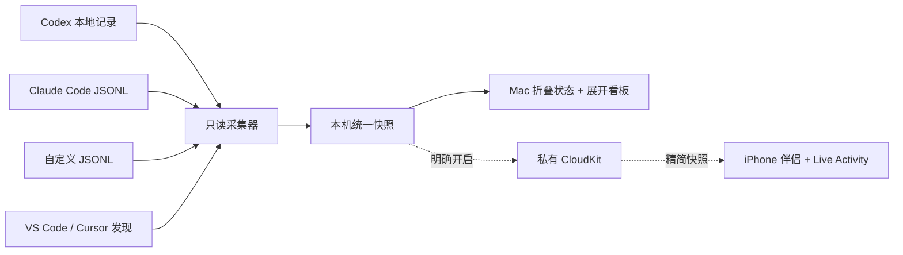

# MAC版灵动岛--Agent运行监测

### 本地 AI Agent 观测台

[English](README.md) · [产品页](https://kiki-lgtm-dot.github.io/mac-agent-monitor-app/) · [隐私政策](https://kiki-lgtm-dot.github.io/mac-agent-monitor-app/privacy/) · [支持与帮助](https://kiki-lgtm-dot.github.io/mac-agent-monitor-app/support/) · [开源许可](LICENSE)

不切窗口，也知道哪些 Agent 正在工作。

**MAC版灵动岛--Agent运行监测** 是一款驻留在 Mac 摄像头/刘海区域的本地优先面板。折叠时只显示 Agent 是否在工作；鼠标悬停后展开实时看板，查看相关工具、运行中的 Agent、对话、工作时长和 Token 用量。它还提供常用网站、备忘录以及可选的翻译学习器。

### 中文界面


### English interface


> **当前状态：**源码预览版。macOS 版可供本地构建使用；iPhone 伴侣、私有 CloudKit 同步、正式签名、公证和 App Store 配置仍需使用你自己的 Apple Developer 标识并完成真机验证。

## 主要功能

- **一行安静状态：**220 × 34 pt 的小胶囊只显示“3 个 Agent 工作中”或“暂无 Agent 工作”。
- **悬停展开：**无需切换应用，即可查看相关工具、活跃 Agent、对话数量、运行时长和 Token。
- **可信历史口径：**区分输入、缓存输入、输出、推理和仅总量数据，并保留来源的质量与覆盖范围。
- **多种本地来源：**支持 Codex、Claude Code 的结构化本地记录，也可连接自定义 JSONL 遥测。
- **不把进程当 Agent：**可以检测 VS Code、Cursor 等宿主，但“已安装/进程运行”“Agent 工作中”“Token 可计量”始终分开表达。
- **快捷工作台：**常用网站、备忘录、中英文界面、翻译、单句定义、拆解、例句和可搜索学习本。
- **无日志也可体验：**需用户主动进入的紫色离线示例会展示虚构 Agent、会话、时长和 Token，不读取 Agent 数据源，不访问网络或 iCloud。
- **可选手机伴侣：**`ApplePlatforms/iOS` 中包含实验性的 SwiftUI 看板和 Live Activity Target。


## 隐私边界

本应用只有在用户确认原生说明后才开始本地监测。

- Agent 发现与用量扫描只读，不修改第三方日志。
- 不提取、展示或保存 prompt 与回复正文。
- 不请求摄像头、麦克风、屏幕录制或辅助功能权限。
- 默认情况下，监测数据、备忘录、网站和学习条目只留在 Mac。
- 只有用户主动提交的翻译文本才会发往所配置的 OpenAI-compatible 服务；API Key 保存在 macOS Keychain。
- 私有 iCloud 同步默认关闭，只导出经过字段白名单精简的快照；完整对话标题需要单独确认。
- 离线示例每次在内存重建虚构监测数据，隐藏既有数据源授权，退出后真实监测仍关闭；工作台内容始终是用户本机数据。

实现级细节见[数据处理与隐私标签说明](docs/release/DATA_HANDLING_AND_PRIVACY_LABELS.md)。仓库内隐私政策仍是发布草案，上线前必须按最终构建补齐。

对外双语[隐私政策](https://kiki-lgtm-dot.github.io/mac-agent-monitor-app/privacy/) 和[支持页面](https://kiki-lgtm-dot.github.io/mac-agent-monitor-app/support/) 由 `docs/site` 发布，发布脚本使用这两个稳定 HTTPS 地址。

## 工作原理



macOS 外壳使用 AppKit 和 `WKWebView`，不依赖 Electron 或第三方运行时。各采集器先把来源证据转换成统一会话模型，再交给界面聚合。

## 数据源与口径

| 来源 | 发现 | 活跃状态 | 时长 | Token 历史 |
| --- | --- | --- | --- | --- |
| Codex 本地 SQLite / JSONL | 支持 | turn / 会话证据 | 来源提供时显示 | 输入、缓存输入、输出、推理，或仅总量回退 |
| Claude Code JSONL | 支持 | 近期结构化活动 | 来源提供时显示 | 输入、缓存输入、输出 |
| VS Code / Cursor 宿主与扩展 | 支持 | 仅宿主/进程状态，除非可归因到会话 | 宿主运行时长 | 没有受支持遥测时显示 `—` |
| 自定义 JSONL | 用户连接 | 来源上报或心跳证据 | 来源提供时显示 | 来源上报字段 |

检测到软件已安装并不等于 Agent 正在工作；没有 Token 遥测时不会按运行时长猜测用量。

## 构建运行

要求：macOS 13 或更高版本、Apple Command Line Tools，以及测试脚本使用的系统 `jq`。

```bash
git clone https://github.com/kiki-lgtm-dot/mac-agent-monitor-app.git
cd mac-agent-monitor-app
./scripts/build-app.sh
open 'dist/MAC版灵动岛--Agent运行监测.app'
```

这里生成的是供本机开发使用的 ad-hoc 签名构建，并非已公证的正式安装包。

运行完整静态与 fixture 测试：

```bash
./scripts/test.sh
./ApplePlatforms/iOS/scripts/validate-project.sh
```

iOS 校验的可选 `--build` 模式需要完整 Xcode 与匹配的 iOS SDK。

## 自定义 JSONL

在“设置 → 高级 · 自定义数据源”中选择 `.jsonl` 文件或目录。最小事件示例：

```json
{
  "agent_id": "worker-01",
  "agent_name": "文档检查",
  "status": "working",
  "timestamp": "2026-09-02T10:00:00Z",
  "duration_ms": 42000,
  "usage": {
    "input_tokens": 8200,
    "cached_input_tokens": 6100,
    "output_tokens": 940
  }
}
```

连接码只登记本地路径与显示信息，不执行命令，也不会抓取远程内容。

## 计量说明

- Token 是来源可观察到的用量，不是供应商账单。
- 缓存输入属于输入子集，不会重复计入总量。
- 会话生命周期累计不会伪装成每日趋势。
- 保留 `exact`、`currentCounter`、`totalOnly`、`reported`、`estimated` 等质量标签。
- 本地存储结构不是供应商承诺的稳定 API；结构变化时适配器可能需要更新。

## 目录结构

```text
Native/                 AppKit 外壳、采集器、存储、Keychain、CloudKit
Web/                    中英文折叠态与展开看板
ApplePlatforms/iOS/     实验性 iPhone App 与 Live Activity Extension
Assets/ + Resources/    图标、Info.plist、隐私清单
Tests/                  已脱敏的测试数据
scripts/                构建、验证、签名和发布工具
docs/                   研究、隐私与上线准备材料
```

## 名称兼容

**MAC版灵动岛--Agent运行监测** 是公开产品名。部分内部标识会继续保留历史 `AgentIsland` 前缀，包括可执行文件/Target、存储键、`agentisland://` Scheme 和当前 CloudKit 记录契约。直接全局改名会破坏旧数据与伴侣端兼容，因此需要单独的迁移版本。

## 参与贡献

欢迎提交问题和范围明确的 Pull Request。请勿上传包含真实任务标题、项目路径、prompt、回复、API Key、Apple 标识或实际 Token 历史的日志与截图。详见 [CONTRIBUTING.md](CONTRIBUTING.md) 与 [SECURITY.md](SECURITY.md)。

## 许可与致谢

MIT © 2026 MAC版灵动岛--Agent运行监测 contributors。详见 [LICENSE](LICENSE) 和 [THIRD_PARTY_NOTICES.md](THIRD_PARTY_NOTICES.md)。

本项目独立开发，与 Apple、OpenAI、Anthropic、Microsoft、Anysphere 及仓库中提到的其他工具供应商均无隶属或背书关系。
