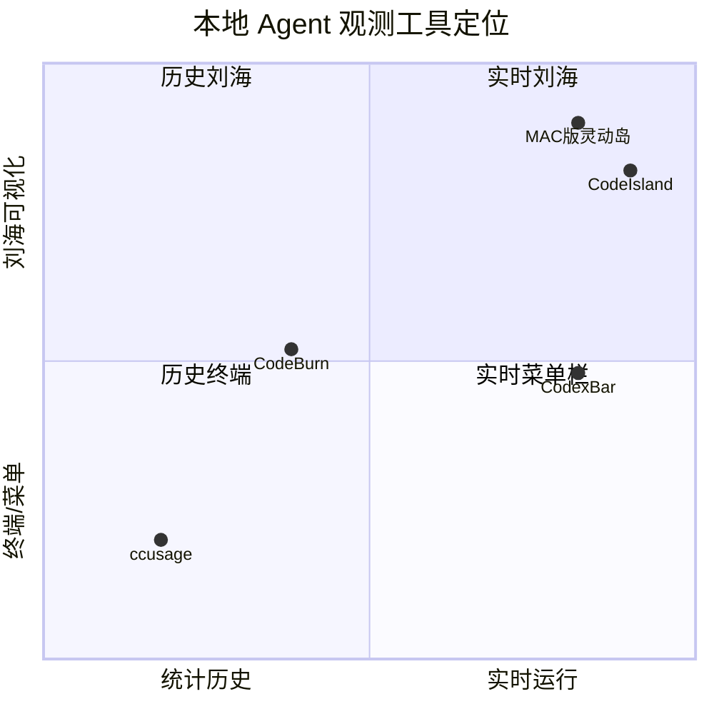

# MAC版灵动岛--Agent运行监测 竞品与实现研究

## 1. 研究范围

- 研究对象：本地 AI coding-agent 会话、Token/时长分析、macOS 刘海/灵动岛应用。
- 研究日期：2026-09-01（Asia/Shanghai）。
- 决策读者：准备做个人/团队 Agent 可观测工具的产品负责人。
- 产品假设：数据默认留在本机；首版优先支持 Codex 与 Claude Code；产品需要常驻但不能妨碍当前工作。
- 指定参考：[VibeCafé Usage](https://vibecafe.ai/usage)、[微信文章中的 TO-DO Panel](https://mp.weixin.qq.com/s/PSjaPYR9eAqB620v402HSQ)。
- 证据边界：Stars、更新时间和页面功能均为调研日公开页面或 GitHub API 的截面；Stars 会继续变化。没有把少量社区反馈外推为整体用户结论。

## 2. 执行结论

> MAC版灵动岛--Agent运行监测 是面向同时运行多个本地 coding agent 的开发者与 AI 重度用户的 macOS 本地观测台，通过读取已有会话元数据并把实时状态固定在刘海区域，帮助用户完成“谁在工作、工作多久、消耗多少 Token、消耗集中在哪”的判断；差异点是把 CodexBar 的实时会话、CodeBurn 的分析维度与 CodeIsland/TO-DO Panel 的刘海交互合成一条路径。首要原则不是追求最多 Provider，而是保证状态、时长和 Token 口径可信且可解释。

【分析推断】不存在一个开源项目同时在“实时状态、Token/成本分析、原生刘海交互”三项都领先。最佳方案是组合三种成熟模式，而不是复制一个仓库。

## 3. GitHub 候选

| 项目 | 调研日 Stars | 最近 push | 许可证 | 最强能力 | 主要缺口 |
|---|---:|---|---|---|---|
| [CodexBar](https://github.com/steipete/CodexBar) | 20,756 | 2026-08-31 | MIT | 原生 Swift macOS；实时发现 Codex/Claude/pi/OMP，会话 active/idle、PID、项目、名称与时间 | 菜单栏而非刘海；实时会话和成本历史不是同一行联表 |
| [ccusage](https://github.com/ccusage/ccusage) | 18,250 | 2026-08-31 | MIT | 日/周/月/session/by-agent、Claude 5h block、Token/cache/cost/JSON | CLI 为主，无原生实时 Agent 状态 |
| [boring.notch](https://github.com/TheBoredTeam/boring.notch) | 10,552 | 2026-08-30 | GPL-3.0 | 通用刘海 shell、媒体/日历/file shelf/HUD | 不含 Agent；直接复用代码会引入 GPL 传播义务 |
| [CodeBurn](https://github.com/getagentseal/codeburn) | 9,781 | 2026-08-31 | MIT | 41 工具/Agent；session/task/model/tool/project；名称、起止、时长、Token、成本 | 主要从会话文件推断，不以进程为实时真源 |
| [Vibe Notch](https://github.com/farouqaldori/vibe-notch) | 2,499 | 2026-04-20 | Apache-2.0 | Claude 多会话刘海、Allow/Deny、hook | Claude-only，无 Token/成本历史 |
| [CodeIsland](https://github.com/wxtsky/CodeIsland) | 2,340 | 2026-08-15 | MIT | 14 工具；刘海实时事件、审批、回答、跳终端/IDE | 缺少 Token/成本分析 |
| [TokenTracker](https://github.com/xiufengsun/TokenTracker) | 1,475 | 2026-08-29 | MIT | 34 工具、网页看板、菜单栏、widgets、本地 SQLite 桶 | 30 分钟桶适合统计，不适合作实时状态真源 |

【分析推断】用户记忆中的“输入一个命令就能看本机会话名、工时和 Token”最可能是 [CodeBurn](https://github.com/getagentseal/codeburn)，其次是 TokenTracker 或 ccusage。

推荐实现基线：CodeIsland 的 MIT 刘海模式 + CodexBar 的 live session 模型 + CodeBurn 的 session analytics。只借鉴行为与信息架构，不复制品牌、视觉资产或 GPL/非商用代码。

## 4. 指定参考实测

### VibeCafé Usage

【公开事实/直接观察】页面无需额外登录即可看到完整使用看板。核心结构是：时间范围（今天、24H、7D、30D、90D、自定义）→ 工具/模型/项目/终端多选 → 10 张指标卡 → 每日趋势与 7×24 分时热图 → 终端/工具/模型/项目分布 → 9 列明细表。

值得复用的设计：

- 纯黑 + Zinc 灰阶，费用绿色、活跃时长蓝色、等宽数字。
- 总 Token、输入、输出、缓存、活跃时长、总时长、会话/消息等口径分开。
- 默认隐藏终端和项目名，用户显式揭示。
- 空筛选结果不保留一堆“0 图表”，而是收敛成单一空态。

不应机械复制的部分：VibeCafé 没有“哪些 Agent 此刻工作”的实时层；明细是日期×终端×工具×模型×项目的聚合，不是单 Agent 执行记录。

### TO-DO Panel 文章

【公开事实/源码验证】文章产品为 [xiaopu-ai/TO-DO-Panel](https://github.com/xiaopu-ai/TO-DO-Panel)，调研时 29 Stars、MIT、v1.0.5、Electron。折叠约 200px×菜单栏高，展开默认 1240×616；点击、Enter、鼠标位于折叠区时按 Space 或全局快捷键展开；顶栏、Esc、失焦或再次快捷键收起；窗口置顶并加入所有 Workspace/全屏空间。

源码中的内容面板会阻止点击冒泡。因此“点击画板收回”应实现为顶部空白/收起手柄、Esc 或点击窗口外部，不能让图表、筛选和 Agent 行任意点击都收回。

原项目的 AI 能力只是完成通知：`127.0.0.1:43821 /notify/{codex,gpt,claude}`，字段只有 taskId/title/project/completedAt，没有运行中状态、心跳、时长或 Token。MAC版灵动岛--Agent运行监测 因而需要独立采集模型，而不是沿用该通知队列。

## 5. 用户与场景

| 目标用户 | 核心需要 | 典型场景 | 当前痛点 | 产品响应 | 选择标准 |
|---|---|---|---|---|---|
| 多 Agent 开发者 | 随时知道谁还在跑 | Codex 主任务并行 3 个 subagent | 在多个终端/任务间切换 | 刘海实时数 + 展开 Agent 列表 | 状态准、干扰低 |
| AI 重度个人用户 | 控制 Token 与时间投入 | 一天跨 Codex、Claude Code | 各工具口径割裂 | Provider/模型/项目/日期聚合 | 本地、可解释 |
| 团队负责人 | 发现高耗低效工作流 | 复盘模型和 Agent 使用 | 只看费用，无法对应工作结果 | Active Time、Session Span、Token 质量并列 | 能导出、可审计 |
| 演示/录屏用户 | 展示状态但不泄密 | 直播 coding-agent 工作流 | 路径与任务名泄露 | 隐私遮罩 | 一键切换 |

## 6. 核心功能判断

MAC版灵动岛--Agent运行监测 采用“采集器 → 统一会话模型 → 本地聚合 → 灵动岛双态 UI”架构。核心不是图表数量，而是 provider/sessionId 联表、重复事件去重和口径标记。

| 模块 | 用户怎么用 | 解决的问题 | 优势 | 弱点 | 后续机会 |
|---|---|---|---|---|---|
| 折叠灵动岛 | 看工作中数量与今日 Token | 不打断当前窗口 | 一眼可见 | 没有全局快捷键 | 自定义热键 |
| 实时 Agent | 查看 working/idle/completed | 找到仍在运行的任务 | Codex turn 状态直接读取 | Claude CLI 只能用最近活动推断 | 进程 + hook 心跳 |
| Token 聚合 | 看输入/输出/缓存/推理 | 找到消耗来源 | 最近会话精确拆分 | 旧会话只有总量 | 增量索引所有 rollout |
| 时长 | Active 与 Span 分开 | 避免把 idle 当工作 | 口径透明 | 工具等待是否算 active 仍需定义 | 增加等待/工具时间 |
| 维度看板 | 日期/Provider/模型/项目 | 从总量下钻 | 接近 VibeCafé 心智 | 暂无费用 | 可更新价格目录 |
| 隐私 | 录屏前开遮罩 | 防止泄露路径/名称 | 本地立即生效 | 不能按字段细分 | 字段级遮罩 |
| 连接码 | 粘贴路径或编码 | 接入内部 Agent | 不执行代码、协议简单 | 目前轮询 JSONL | 鉴权 UDS 实时流 |

## 7. 代表性用户旅程

| 阶段 | 用户动作 | 主要摩擦 | 情绪/成本 | 产品响应 | 机会 | 指标 |
|---|---|---|---|---|---|---|
| 启动 | 双击 app | 不知道是否已读取数据 | 不确定 | 折叠态状态点、数据源计数 | 首次引导 | 首次可用数据时间 |
| 并行执行 | 启动多个 Agent | 窗口分散 | 注意力切换 | 刘海显示工作中数量 | 完成通知 | 状态发现延迟 |
| 检查 | 点击刘海 | 信息太多 | 认知负担 | 活跃 strip + KPI +趋势 | 可定制首页 | 找到目标 Agent 时间 |
| 下钻 | 搜索/筛选 Agent | Token 口径不同 | 不信任 | 精确/仅总量/外部上报标签 | 口径详情抽屉 | 非精确数据占比 |
| 收起 | 点击手柄、Esc 或桌面 | 任意点击收起会误操作 | 烦躁 | 内容点击不冒泡 | 全局热键 | 误收起率 |

最大的体验断点不是展开动画，而是“状态与 Token 是否可信”。如果数据标签含糊，再漂亮的图表也无法支撑决策。

## 8. 定位矩阵

【分析推断】MAC版灵动岛--Agent运行监测 的机会位于“实时 × 刘海 × 历史分析”的交叉点。CodeIsland 实时更强，CodeBurn 历史维度更全，但二者都没有形成同一页面上的完整闭环。

## 9. 能力评分

评分为桌面研究推断，1–5 分，不是统一环境实测 benchmark。

| 维度 | MAC版灵动岛 | CodexBar | CodeBurn | CodeIsland | VibeCafé |
|---|---:|---:|---:|---:|---:|
| 实时 Agent 状态 | 4 | 5 | 2 | 5 | 1 |
| Token/缓存拆分 | 4 | 4 | 5 | 1 | 5 |
| 时长口径透明 | 4 | 3 | 2 | 2 | 5 |
| 多维分析 | 4 | 4 | 5 | 1 | 5 |
| 刘海交互 | 4 | 1 | 2 | 5 | 1 |
| Provider 广度 | 2 | 5 | 5 | 4 | 3 |
| 隐私控制 | 4 | 4 | 3 | 3 | 4 |
| 接入扩展性 | 4 | 4 | 4 | 4 | 2 |

决策含义：首版无需追逐 40+ Provider。先把 Codex/Claude 的“状态、时长、Token”做到可信，再用通用 JSONL/UDS 扩展，能更快形成差异化。

## 10. 业务与增长

- 免费激活边界：本地只读、Codex/Claude、基础看板应保持免费，降低安装与信任门槛。
- 付费触发：团队共享、历史索引、预算策略、异常告警、远程 Agent、审计导出，而不是把本地数字展示本身收费。
- 留存机制：每天自然发生的新会话会持续更新；周报和预算提醒可形成周期回访。
- 传播路径：隐私遮罩后的截图/周报、可分享但不含正文的统计卡。
- 风险：本地 schema 变化、不同 Provider Token 语义、价格变化、无鉴权 localhost hook、路径与任务名隐私。

## 11. 建议

| 优先级 | 问题 | 目标用户 | 方案 | 用户价值 | 业务价值 | 指标 | 风险 | 验证 |
|---|---|---|---|---|---|---|---|---|
| P0 | Claude 状态依赖文件时间 | 多 Agent 开发者 | 进程扫描 + 安装级密钥 UDS 心跳 | 减少假 active/idle | 建立可信度 | 状态误判率、发现延迟 | 权限与 hook 兼容 | 与终端真值对照 100 次 |
| P0 | 旧 Codex 只有总量拆分 | 重度用户 | 增量 rollout 索引与文件 offset 缓存 | 完整历史输入/输出/缓存 | 支撑预算功能 | 精确覆盖率 | 首次索引 IO | 1000 会话性能基准 |
| P1 | 无费用 | 预算用户 | 可版本化价格目录，明确订阅/API 口径 | 可估预算 | 付费触发 | 价格匹配率 | 标价变化 | 10 个高频模型核对 |
| P1 | 收起入口依赖鼠标 | 键盘用户 | 全局快捷键与可配置折叠宽度 | 更少指针移动 | 提高日活 | 快捷键使用率 | 冲突 | 5 位重度用户试用 |

## 12. 资料来源

- [CodexBar](https://github.com/steipete/CodexBar) 与 [Agent Sessions 文档](https://github.com/steipete/CodexBar/blob/main/docs/sessions.md)
- [CodeBurn](https://github.com/getagentseal/codeburn) 与 [Codex provider 文档](https://github.com/getagentseal/codeburn/blob/main/docs/providers/codex.md)
- [ccusage](https://github.com/ccusage/ccusage)
- [CodeIsland](https://github.com/wxtsky/CodeIsland)
- [TokenTracker](https://github.com/xiufengsun/TokenTracker)
- [Vibe Notch](https://github.com/farouqaldori/vibe-notch)
- [TO-DO Panel](https://github.com/xiaopu-ai/TO-DO-Panel) 与 [v1.0.5](https://github.com/xiaopu-ai/TO-DO-Panel/releases/tag/v1.0.5)
- [VibeCafé Usage](https://vibecafe.ai/usage)
- [OpenAI Responses API usage 字段](https://developers.openai.com/api/reference/cli/resources/responses/methods/create)

## 13. 决策摘要

- **P0｜发现：实时状态、Token 与刘海交互分散在不同产品；机会：把三条能力按 sessionId 联成一条可信路径；建议动作：先稳定 Codex/Claude 的状态与计量适配。**
- **P0｜发现：会话跨度不等于工作时长，旧记录也不一定有完整拆分；机会：用 Active/Span 和质量标签建立信任；建议动作：持续提升精确覆盖率并公开口径。**
- **P1｜发现：VibeCafé 的分析维度成熟但缺实时 Agent；机会：以实时 strip 作为进入多维看板的首屏；建议动作：下一版补 UDS 心跳、全局快捷键与可靠价格目录。**
